# 增强策略复用流程设计

## 概述

本文档描述了策略复用功能的增强版本，支持三种复用场景：
1. 地址组复用：向现有地址组添加新地址
2. 服务组复用：向现有服务组添加新服务
3. 策略复用：生成包含差异部分的新策略

## 流程示意图

```mermaid
flowchart TD
    Start([策略生成开始]) --> CheckReuse{检查复用配置}
    CheckReuse -->|ReusePolicy=false| NormalFlow[正常生成流程]
    CheckReuse -->|ReusePolicy=true| FindPolicy[查找匹配策略]
    
    FindPolicy --> PolicyFound{找到匹配策略?}
    PolicyFound -->|否| NormalFlow
    PolicyFound -->|是| AnalyzePolicy[分析策略使用的对象类型]
    
    AnalyzePolicy --> CheckSrcObj[检查源地址对象类型]
    CheckSrcObj --> SrcIsGroup{源地址是地址组?}
    
    AnalyzePolicy --> CheckDstObj[检查目标地址对象类型]
    CheckDstObj --> DstIsGroup{目标地址是地址组?}
    
    AnalyzePolicy --> CheckSvcObj[检查服务对象类型]
    CheckSvcObj --> SvcIsGroup{服务是服务组?}
    
    SrcIsGroup -->|是| CalcSrcDiff[计算源地址差异]
    SrcIsGroup -->|否| CheckDstObj
    
    DstIsGroup -->|是| CalcDstDiff[计算目标地址差异]
    DstIsGroup -->|否| CheckSvcObj
    
    SvcIsGroup -->|是| CalcSvcDiff[计算服务差异]
    SvcIsGroup -->|否| CheckReuseMode
    
    CalcSrcDiff --> HasSrcDiff{有源地址差异?}
    HasSrcDiff -->|是| AddToSrcGroup[生成地址组更新CLI<br/>添加源地址到组]
    HasSrcDiff -->|否| CheckDstObj
    
    CalcDstDiff --> HasDstDiff{有目标地址差异?}
    HasDstDiff -->|是| AddToDstGroup[生成地址组更新CLI<br/>添加目标地址到组]
    HasDstDiff -->|否| CheckSvcObj
    
    CalcSvcDiff --> HasSvcDiff{有服务差异?}
    HasSvcDiff -->|是| AddToSvcGroup[生成服务组更新CLI<br/>添加服务到组]
    HasSvcDiff -->|否| CheckReuseMode
    
    AddToSrcGroup --> CheckDstObj
    AddToDstGroup --> CheckSvcObj
    AddToSvcGroup --> CheckReuseMode
    
    CheckReuseMode{检查复用模式}
    CheckReuseMode -->|EnhancedReuse| EnhancedReuseFlow[增强复用流程]
    CheckReuseMode -->|StandardReuse| StandardReuseFlow[标准复用流程]
    
    EnhancedReuseFlow --> CheckAllGroups{所有差异都<br/>通过组更新处理?}
    CheckAllGroups -->|是| GroupUpdateOnly[仅生成组更新CLI<br/>不生成策略CLI]
    CheckAllGroups -->|否| GenerateDiffPolicy[生成差异策略<br/>包含未处理的差异]
    
    StandardReuseFlow --> CalcAllDiff[计算所有差异]
    CalcAllDiff --> GenerateDiffPolicy
    
    GenerateDiffPolicy --> PrepareDiffIntent[准备差异Intent<br/>只包含差异部分]
    PrepareDiffIntent --> GenDiffObjects[生成差异对象<br/>地址对象/服务对象]
    GenDiffObjects --> GenDiffPolicy[生成差异策略CLI]
    
    GroupUpdateOnly --> MergeResults[合并结果]
    GenDiffPolicy --> MergeResults
    NormalFlow --> MergeResults
    
    MergeResults --> End([返回结果])
    
    style AddToSrcGroup fill:#e1f5ff
    style AddToDstGroup fill:#e1f5ff
    style AddToSvcGroup fill:#e1f5ff
    style GroupUpdateOnly fill:#c8e6c9
    style GenerateDiffPolicy fill:#fff9c4
    style NormalFlow fill:#ffccbc
```



## 详细流程说明

### 阶段1：策略查找与匹配

1. **查找匹配策略**
   - 使用 `FindPolicyByIntent` 查找匹配的策略
   - 匹配条件：源区域、目标区域、源地址、目标地址、服务

### 阶段2：对象类型分析

2. **分析策略使用的对象类型**
   - 通过 `FirewallPolicy` 接口的新方法获取对象信息
   - 判断源地址是否使用地址组
   - 判断目标地址是否使用地址组
   - 判断服务是否使用服务组

### 阶段3：差异计算

3. **计算差异**
   - 使用 `SubtractWithTwoSame` 计算源地址差异
   - 使用 `SubtractWithTwoSame` 计算目标地址差异
   - 使用 `SubtractWithTwoSame` 计算服务差异

### 阶段4：生成配置

4. **根据对象类型和差异生成配置**

   **场景A：地址组复用**
   - 如果源地址使用地址组且有差异 → 生成地址组更新CLI（添加新地址）
   - 如果目标地址使用地址组且有差异 → 生成地址组更新CLI（添加新地址）
   - 不生成策略CLI

   **场景B：服务组复用**
   - 如果服务使用服务组且有差异 → 生成服务组更新CLI（添加新服务）
   - 不生成策略CLI

   **场景C：策略复用**
   - 如果没有使用地址组或服务组
   - 或者有差异但无法通过组更新处理
   - 生成新的策略CLI（只包含差异部分）

## 需要的基础能力

### FirewallPolicy 接口扩展

```go
// 获取策略使用的源地址对象
GetSourceAddressObject() (FirewallNetworkObject, bool)

// 获取策略使用的目标地址对象
GetDestinationAddressObject() (FirewallNetworkObject, bool)

// 获取策略使用的服务对象
GetServiceObject() (FirewallServiceObject, bool)
```

### 地址组/服务组更新能力

```go
// 生成向地址组添加成员的CLI
GenerateAddressGroupAddMember(groupName string, newAddresses *network.NetworkGroup) (string, error)

// 生成向服务组添加成员的CLI
GenerateServiceGroupAddMember(groupName string, newServices *service.Service) (string, error)
```

## 配置选项

### PolicyGeneratorConfig 扩展

```go
type PolicyReuseMode string

const (
    ReuseModeStandard PolicyReuseMode = "standard"  // 标准复用（当前实现）
    ReuseModeEnhanced PolicyReuseMode = "enhanced"  // 增强复用（新实现）
)

type PolicyGeneratorConfig struct {
    // ... 现有字段
    ReusePolicy         bool
    ReusePolicyMode     PolicyReuseMode  // 新增：复用模式选择
    // ... 其他字段
}
```

## 实现要点

1. **对象类型判断**
   - 通过 `FirewallNetworkObject.Type()` 判断是否为 `GROUP_NETWORK`
   - 通过 `FirewallServiceObject.Type()` 判断是否为 `GROUP_SERVICE`

2. **差异计算**
   - 使用现有的 `SubtractWithTwoSame` 方法
   - 返回的差异是 intent 中有但 policy 中没有的部分

3. **CLI生成**
   - 地址组更新：使用新的模板 `AddressGroupAddMember`
   - 服务组更新：使用新的模板 `ServiceGroupAddMember`
   - 差异策略：使用现有的 `Policy` 模板，但只包含差异部分

4. **结果合并**
   - 如果只更新组，结果中不包含 `SECURITY_POLICY`
   - 如果生成差异策略，结果中包含 `SECURITY_POLICY` 和相关的对象CLI

