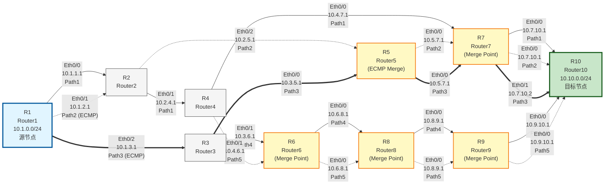

# 多跳多路径路由描述表

## 拓扑概述

- **源网络**: 10.1.0.0/24 (在R1)
- **目标网络**: 10.10.0.0/24 (在R10)
- **节点数量**: 10个节点 (R1-R10)
- **路径深度**: 5-7跳
- **ECMP场景**: 多个节点存在ECMP分支
- **路径合并**: 多条路径汇聚到同一节点

## 拓扑图

### 图例说明

- **实线箭头 (-->)**: Path1 (基础路径) 和 Path4 (路径合并)
- **虚线箭头 (-.->)**: Path2 (ECMP分支1) 和 Path5 (路径合并)
- **点线箭头 (==>)**: Path3 (ECMP分支2)
- **蓝色节点**: 源节点 (R1)
- **绿色节点**: 目标节点 (R10)
- **黄色节点**: 路径合并点 (R5, R6, R7, R8, R9)
- **灰色节点**: 普通中间节点 (R2, R3, R4)

## 路径定义

| 路径ID | 路径描述 | 跳数 | 路径详情 | 备注 |
|--------|----------|------|----------|------|
| Path1 | R1 -> R2 -> R4 -> R7 -> R10 | 5 | R1:Eth0/0 -> R2:Eth0/1 -> R4:Eth0/0 -> R7:Eth0/0 -> R10:Eth0/0 | 基础路径 |
| Path2 | R1 -> R2 -> R5 -> R7 -> R10 | 5 | R1:Eth0/1 -> R2:Eth0/2 -> R5:Eth0/0 -> R7:Eth0/1 -> R10:Eth0/0 | ECMP分支1 |
| Path3 | R1 -> R3 -> R5 -> R7 -> R10 | 5 | R1:Eth0/2 -> R3:Eth0/0 -> R5:Eth0/1 -> R7:Eth0/1 -> R10:Eth0/0 | ECMP分支2 |
| Path4 | R1 -> R3 -> R6 -> R8 -> R9 -> R10 | 6 | R1:Eth0/2 -> R3:Eth0/1 -> R6:Eth0/0 -> R8:Eth0/0 -> R9:Eth0/0 -> R10:Eth0/1 | 路径合并 |
| Path5 | R1 -> R2 -> R4 -> R6 -> R8 -> R9 -> R10 | 7 | R1:Eth0/0 -> R2:Eth0/1 -> R4:Eth0/1 -> R6:Eth0/1 -> R8:Eth0/0 -> R9:Eth0/0 -> R10:Eth0/1 | 路径合并 |

## 节点信息表

| 节点ID | 节点名称 | 节点类型 | 主要VRF | 描述 |
|--------|----------|----------|---------|------|
| R1 | Router1 | router | default | 源节点，连接多个下游节点 |
| R2 | Router2 | router | default | 中间节点，支持ECMP |
| R3 | Router3 | router | default | 中间节点，支持ECMP |
| R4 | Router4 | router | default | 中间节点，连接R2和R6/R7 |
| R5 | Router5 | router | default | 中间节点，ECMP汇聚点 |
| R6 | Router6 | router | default | 中间节点，路径合并点 |
| R7 | Router7 | router | default | 中间节点，多条路径汇聚 |
| R8 | Router8 | router | default | 中间节点，路径合并点 |
| R9 | Router9 | router | default | 中间节点，最终汇聚点 |
| R10 | Router10 | router | default | 目标节点，多条路径终点 |

## 端口信息表

| 端口ID | 端口名称 | 所属节点 | IP地址 | VRF | 连接器ID | 描述 |
|--------|----------|----------|--------|-----|----------|------|
| R1-Eth0/0 | Eth0/0 | R1 | 10.1.1.1/24 | default | Conn-R1-R2-1 | 连接R2 |
| R1-Eth0/1 | Eth0/1 | R1 | 10.1.2.1/24 | default | Conn-R1-R2-2 | 连接R2 (ECMP) |
| R1-Eth0/2 | Eth0/2 | R1 | 10.1.3.1/24 | default | Conn-R1-R3 | 连接R3 |
| R1-Eth0/3 | Eth0/3 | R1 | 10.1.0.1/24 | default | - | 源网络端口 |
| R2-Eth0/0 | Eth0/0 | R2 | 10.2.1.1/24 | default | Conn-R1-R2-1 | 连接R1 |
| R2-Eth0/1 | Eth0/1 | R2 | 10.2.4.1/24 | default | Conn-R2-R4-1 | 连接R4 |
| R2-Eth0/2 | Eth0/2 | R2 | 10.2.5.1/24 | default | Conn-R2-R5 | 连接R5 |
| R2-Eth0/3 | Eth0/3 | R2 | 10.2.1.2/24 | default | Conn-R1-R2-2 | 连接R1 (ECMP) |
| R3-Eth0/0 | Eth0/0 | R3 | 10.3.5.1/24 | default | Conn-R3-R5 | 连接R5 |
| R3-Eth0/1 | Eth0/1 | R3 | 10.3.6.1/24 | default | Conn-R3-R6 | 连接R6 |
| R3-Eth0/2 | Eth0/2 | R3 | 10.3.1.1/24 | default | Conn-R1-R3 | 连接R1 |
| R4-Eth0/0 | Eth0/0 | R4 | 10.4.7.1/24 | default | Conn-R4-R7 | 连接R7 |
| R4-Eth0/1 | Eth0/1 | R4 | 10.4.6.1/24 | default | Conn-R4-R6 | 连接R6 |
| R4-Eth0/2 | Eth0/2 | R4 | 10.4.1.1/24 | default | Conn-R2-R4-1 | 连接R2 |
| R5-Eth0/0 | Eth0/0 | R5 | 10.5.7.1/24 | default | Conn-R5-R7 | 连接R7 |
| R5-Eth0/1 | Eth0/1 | R5 | 10.5.1.1/24 | default | Conn-R3-R5 | 连接R3 |
| R5-Eth0/2 | Eth0/2 | R5 | 10.5.2.1/24 | default | Conn-R2-R5 | 连接R2 |
| R6-Eth0/0 | Eth0/0 | R6 | 10.6.8.1/24 | default | Conn-R6-R8 | 连接R8 |
| R6-Eth0/1 | Eth0/1 | R6 | 10.6.1.1/24 | default | Conn-R4-R6 | 连接R4 |
| R6-Eth0/2 | Eth0/2 | R6 | 10.6.3.1/24 | default | Conn-R3-R6 | 连接R3 |
| R7-Eth0/0 | Eth0/0 | R7 | 10.7.10.1/24 | default | Conn-R7-R10-1 | 连接R10 |
| R7-Eth0/1 | Eth0/1 | R7 | 10.7.10.2/24 | default | Conn-R7-R10-2 | 连接R10 (ECMP) |
| R7-Eth0/2 | Eth0/2 | R7 | 10.7.1.1/24 | default | Conn-R4-R7 | 连接R4 |
| R7-Eth0/3 | Eth0/3 | R7 | 10.7.2.1/24 | default | Conn-R5-R7 | 连接R5 |
| R8-Eth0/0 | Eth0/0 | R8 | 10.8.9.1/24 | default | Conn-R8-R9 | 连接R9 |
| R8-Eth0/1 | Eth0/1 | R8 | 10.8.1.1/24 | default | Conn-R6-R8 | 连接R6 |
| R9-Eth0/0 | Eth0/0 | R9 | 10.9.10.1/24 | default | Conn-R9-R10 | 连接R10 |
| R9-Eth0/1 | Eth0/1 | R9 | 10.9.1.1/24 | default | Conn-R8-R9 | 连接R8 |
| R10-Eth0/0 | Eth0/0 | R10 | 10.10.0.1/24 | default | Conn-R7-R10-1 | 目标网络端口 |
| R10-Eth0/1 | Eth0/1 | R10 | 10.10.0.2/24 | default | Conn-R9-R10 | 目标网络端口 (ECMP) |
| R10-Eth0/2 | Eth0/2 | R10 | 10.10.1.1/24 | default | Conn-R7-R10-2 | 目标网络端口 (ECMP) |

## 路由表

### R1 路由表

| 目标网络 | 下一跳IP | 出接口 | 是否直连 | 备注 |
|----------|----------|--------|----------|------|
| 10.1.0.0/24 | - | Eth0/3 | true | 源网络，直连 |
| 10.10.0.0/24 | 10.1.1.2 | Eth0/0 | false | 路径1 |
| 10.10.0.0/24 | 10.1.2.2 | Eth0/1 | false | 路径2 (ECMP) |
| 10.10.0.0/24 | 10.1.3.2 | Eth0/2 | false | 路径3/4 (ECMP) |

### R2 路由表

| 目标网络 | 下一跳IP | 出接口 | 是否直连 | 备注 |
|----------|----------|--------|----------|------|
| 10.2.1.0/24 | - | Eth0/0 | true | 直连网络 |
| 10.2.4.0/24 | - | Eth0/1 | true | 直连网络 |
| 10.2.5.0/24 | - | Eth0/2 | true | 直连网络 |
| 10.10.0.0/24 | 10.2.4.2 | Eth0/1 | false | 路径1 |
| 10.10.0.0/24 | 10.2.5.2 | Eth0/2 | false | 路径2 (ECMP) |

### R3 路由表

| 目标网络 | 下一跳IP | 出接口 | 是否直连 | 备注 |
|----------|----------|--------|----------|------|
| 10.3.1.0/24 | - | Eth0/2 | true | 直连网络 |
| 10.3.5.0/24 | - | Eth0/0 | true | 直连网络 |
| 10.3.6.0/24 | - | Eth0/1 | true | 直连网络 |
| 10.10.0.0/24 | 10.3.5.2 | Eth0/0 | false | 路径3 |
| 10.10.0.0/24 | 10.3.6.2 | Eth0/1 | false | 路径4 (ECMP) |

### R4 路由表

| 目标网络 | 下一跳IP | 出接口 | 是否直连 | 备注 |
|----------|----------|--------|----------|------|
| 10.4.1.0/24 | - | Eth0/2 | true | 直连网络 |
| 10.4.7.0/24 | - | Eth0/0 | true | 直连网络 |
| 10.4.6.0/24 | - | Eth0/1 | true | 直连网络 |
| 10.10.0.0/24 | 10.4.7.2 | Eth0/0 | false | 路径1 |
| 10.10.0.0/24 | 10.4.6.2 | Eth0/1 | false | 路径5 (ECMP) |

### R5 路由表

| 目标网络 | 下一跳IP | 出接口 | 是否直连 | 备注 |
|----------|----------|--------|----------|------|
| 10.5.1.0/24 | - | Eth0/1 | true | 直连网络 |
| 10.5.2.0/24 | - | Eth0/2 | true | 直连网络 |
| 10.5.7.0/24 | - | Eth0/0 | true | 直连网络 |
| 10.10.0.0/24 | 10.5.7.2 | Eth0/0 | false | 路径2/3汇聚 |

### R6 路由表

| 目标网络 | 下一跳IP | 出接口 | 是否直连 | 备注 |
|----------|----------|--------|----------|------|
| 10.6.1.0/24 | - | Eth0/1 | true | 直连网络 |
| 10.6.3.0/24 | - | Eth0/2 | true | 直连网络 |
| 10.6.8.0/24 | - | Eth0/0 | true | 直连网络 |
| 10.10.0.0/24 | 10.6.8.2 | Eth0/0 | false | 路径4/5合并点 |

### R7 路由表

| 目标网络 | 下一跳IP | 出接口 | 是否直连 | 备注 |
|----------|----------|--------|----------|------|
| 10.7.1.0/24 | - | Eth0/2 | true | 直连网络 |
| 10.7.2.0/24 | - | Eth0/3 | true | 直连网络 |
| 10.7.10.0/24 | - | Eth0/0 | true | 直连网络 |
| 10.10.0.0/24 | 10.7.10.2 | Eth0/0 | false | 路径1/2/3汇聚 |
| 10.10.0.0/24 | 10.7.10.3 | Eth0/1 | false | 路径1/2/3汇聚 (ECMP) |

### R8 路由表

| 目标网络 | 下一跳IP | 出接口 | 是否直连 | 备注 |
|----------|----------|--------|----------|------|
| 10.8.1.0/24 | - | Eth0/1 | true | 直连网络 |
| 10.8.9.0/24 | - | Eth0/0 | true | 直连网络 |
| 10.10.0.0/24 | 10.8.9.2 | Eth0/0 | false | 路径4/5合并点 |

### R9 路由表

| 目标网络 | 下一跳IP | 出接口 | 是否直连 | 备注 |
|----------|----------|--------|----------|------|
| 10.9.1.0/24 | - | Eth0/1 | true | 直连网络 |
| 10.9.10.0/24 | - | Eth0/0 | true | 直连网络 |
| 10.10.0.0/24 | 10.9.10.2 | Eth0/0 | false | 路径4/5最终汇聚 |

### R10 路由表

| 目标网络 | 下一跳IP | 出接口 | 是否直连 | 备注 |
|----------|----------|--------|----------|------|
| 10.10.0.0/24 | - | Eth0/0 | true | 目标网络，直连 |
| 10.10.0.0/24 | - | Eth0/1 | true | 目标网络，直连 (ECMP) |
| 10.10.0.0/24 | - | Eth0/2 | true | 目标网络，直连 (ECMP) |

## 连接器表

| 连接器ID | 端口1 | 端口2 | 描述 |
|----------|-------|-------|------|
| Conn-R1-R2-1 | R1-Eth0/0 | R2-Eth0/0 | R1到R2连接1 |
| Conn-R1-R2-2 | R1-Eth0/1 | R2-Eth0/3 | R1到R2连接2 (ECMP) |
| Conn-R1-R3 | R1-Eth0/2 | R3-Eth0/2 | R1到R3连接 |
| Conn-R2-R4-1 | R2-Eth0/1 | R4-Eth0/2 | R2到R4连接 |
| Conn-R2-R5 | R2-Eth0/2 | R5-Eth0/2 | R2到R5连接 |
| Conn-R3-R5 | R3-Eth0/0 | R5-Eth0/1 | R3到R5连接 |
| Conn-R3-R6 | R3-Eth0/1 | R6-Eth0/2 | R3到R6连接 |
| Conn-R4-R6 | R4-Eth0/1 | R6-Eth0/1 | R4到R6连接 |
| Conn-R4-R7 | R4-Eth0/0 | R7-Eth0/2 | R4到R7连接 |
| Conn-R5-R7 | R5-Eth0/0 | R7-Eth0/3 | R5到R7连接 |
| Conn-R6-R8 | R6-Eth0/0 | R8-Eth0/1 | R6到R8连接 |
| Conn-R7-R10-1 | R7-Eth0/0 | R10-Eth0/0 | R7到R10连接1 |
| Conn-R7-R10-2 | R7-Eth0/1 | R10-Eth0/2 | R7到R10连接2 (ECMP) |
| Conn-R8-R9 | R8-Eth0/0 | R9-Eth0/1 | R8到R9连接 |
| Conn-R9-R10 | R9-Eth0/0 | R10-Eth0/1 | R9到R10连接 |

## ECMP场景说明

### ECMP点1: R1
- **场景**: R1到目标网络10.10.0.0/24有3条等价路径
- **路径**: 
  - 路径1: Eth0/0 -> R2 -> R4 -> R7 -> R10
  - 路径2: Eth0/1 -> R2 -> R5 -> R7 -> R10
  - 路径3/4: Eth0/2 -> R3 -> (R5/R6) -> ...

### ECMP点2: R2
- **场景**: R2到目标网络有2条等价路径
- **路径**:
  - 路径1: Eth0/1 -> R4 -> R7 -> R10
  - 路径2: Eth0/2 -> R5 -> R7 -> R10

### ECMP点3: R3
- **场景**: R3到目标网络有2条等价路径
- **路径**:
  - 路径3: Eth0/0 -> R5 -> R7 -> R10
  - 路径4: Eth0/1 -> R6 -> R8 -> R9 -> R10

### ECMP点4: R4
- **场景**: R4到目标网络有2条等价路径
- **路径**:
  - 路径1: Eth0/0 -> R7 -> R10
  - 路径5: Eth0/1 -> R6 -> R8 -> R9 -> R10

### ECMP点5: R7
- **场景**: R7到目标网络有2条等价路径
- **路径**:
  - 路径1/2/3: Eth0/0 -> R10
  - 路径1/2/3: Eth0/1 -> R10

### ECMP点6: R10
- **场景**: R10有3个端口连接到目标网络
- **端口**: Eth0/0, Eth0/1, Eth0/2

## 路径合并场景说明

### 合并点1: R5
- **合并路径**: 路径2和路径3在此汇聚
- **输入**: R2 -> R5, R3 -> R5
- **输出**: R5 -> R7 -> R10

### 合并点2: R6
- **合并路径**: 路径4和路径5在此汇聚
- **输入**: R3 -> R6, R4 -> R6
- **输出**: R6 -> R8 -> R9 -> R10

### 合并点3: R7
- **合并路径**: 路径1、路径2、路径3在此汇聚
- **输入**: R4 -> R7, R5 -> R7
- **输出**: R7 -> R10 (2条ECMP路径)

### 合并点4: R8
- **合并路径**: 路径4和路径5在此汇聚
- **输入**: R6 -> R8
- **输出**: R8 -> R9 -> R10

### 合并点5: R9
- **合并路径**: 路径4和路径5在此最终汇聚
- **输入**: R8 -> R9
- **输出**: R9 -> R10

## 测试场景建议

1. **基础路径测试**: 测试Path1的完整路径
2. **ECMP测试**: 测试R1的3条ECMP路径
3. **路径合并测试**: 测试路径4和路径5在R6、R8、R9的合并
4. **多跳测试**: 测试最长路径Path5 (7跳)
5. **混合场景测试**: 同时测试多条路径的查询和计算

